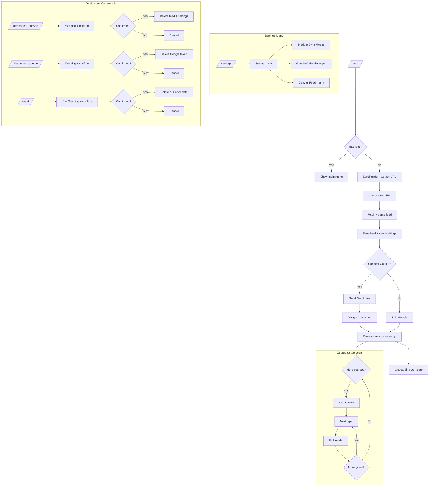

# CanvasLink Onboarding & Settings Redesign Plan

## Overview

Redesign the bot's first-time user experience, settings menu, and add new commands (`/disconnect_canvas`, `/disconnect_google`, `/reset`). The key change is that `/start` becomes a guided onboarding wizard instead of just showing instructions.

---

## 1. New Onboarding Flow (Wizard)

### Step 1: `/start` — The Guide Message

When a user sends `/start`, the bot checks if they already have a feed connected. If yes, skip to the main menu. If no, send a detailed guide:

```
🎓 Welcome to CanvasLink!

I'll sync your Canvas assignments to Google Calendar automatically.

First, let's connect your Canvas account.

📋 How to get your Canvas link:
1. Log into Canvas (NUS Canvas, etc.)
2. Go to Calendar → Calendar Settings
3. Scroll to "Calendar Feed" section
4. Copy the iCal feed URL (ends in .ics)

Then just paste the link here and I'll take it from there!
```

The bot then waits for the user to paste a URL directly (no `/connect_canvas` command needed). Any non-command text message is treated as a potential iCal URL.

### Step 2: Paste Link → Parse → Confirm

User pastes the URL. Bot:
1. Saves the feed to DB
2. Fetches and parses the feed
3. Detects courses and events
4. Seeds default settings (all Active)
5. Reports back:

```
✅ Canvas connected! I found 5 modules with 42 events.

Now, would you like to connect Google Calendar?
Your assignments will automatically appear in your calendar.

[✅ Yes, connect Google] [🚫 No, skip for now]
```

### Step 3a: Google Calendar Connection (if Yes)

User taps [✅ Yes, connect Google]. Bot sends:

```
🔗 Click here to connect Google Calendar:
[Connect Google Calendar](https://accounts.google.com/o/oauth2/auth?...)

This will let me create events on your calendar.
You can always connect later with /connect_google.
```

The URL is a clickable hyperlink (Telegram supports Markdown links). After auth, the bot proceeds to Step 4.

### Step 3b: Skip Google (if No)

User taps [🚫 No, skip for now]. Bot sends:

```
No problem! You can still receive notifications here in Telegram.
You can connect Google Calendar anytime with /connect_google.

Let's set up your sync preferences now.
```

### Step 4: One-by-One Course Setup

After Google decision, the bot walks through each detected course one at a time:

```
📚 Course 1/5: CP2106
How should I handle assignments for this module?

[🚀 Auto] [🔔 Active] [🚫 Ignore]
```

User picks a mode. Then:

```
📚 Course 1/5: CP2106
How should I handle quizzes?

[🚀 Auto] [🔔 Active] [🚫 Ignore]
```

Then exams, then move to course 2/5, etc. This is done via inline keyboard buttons.

**State machine approach**: The bot tracks the user's onboarding progress in a new `onboarding_state` column or a separate table, so if the user leaves mid-wizard, they can resume.

### Step 5: Done

After all courses configured:

```
✅ All set! CanvasLink is now monitoring your Canvas feed.

Here's a summary:
📚 5 modules configured
🔔 Active mode: you'll get a notification for each new event
🚀 Auto mode: events go straight to your calendar
🚫 Ignore mode: events are filtered out

You can change these anytime with /settings.

I'll check for new events every hour.
```

---

## 2. New `/settings` Menu

Replace the current direct-to-modules-menu with a settings hub:

```
⚙️ CanvasLink Settings

[📚 Module Sync Modes] — Configure per-module, per-type behavior
[🔗 Google Calendar] — Connect or disconnect Google Calendar
[📡 Canvas Feed] — View or change your Canvas feed URL
```

**Button name for module settings**: "📚 Module Sync Modes"

The existing module matrix UI (course → type → mode selection) stays the same when user taps "Module Sync Modes".

---

## 3. New Commands

### `/disconnect_canvas`

1. Bot checks if user has a feed
2. If yes, sends warning:

```
⚠️ Disconnect Canvas?

This will:
• Remove your Canvas feed URL
• Delete all your sync settings (course modes)
• Events already in Google Calendar will NOT be removed

You'll need to go through onboarding again to reconnect.

[✅ Yes, disconnect] [🔙 Cancel]
```

3. On confirm: delete feed, delete course settings, delete synced events, delete pending actions. Google token stays. Feed stays in calendar.

### `/disconnect_google`

1. Bot checks if user has Google connected
2. If yes, sends:

```
⚠️ Disconnect Google Calendar?

This will:
• Remove your Google Calendar connection
• Events already in Google Calendar will NOT be removed
• New events will still be detected but won't sync to Google

[✅ Yes, disconnect] [🔙 Cancel]
```

3. On confirm: delete Google token only.

### `/reset`

1. Sends warning:

```
⚠️⚠️ RESET ALL DATA ⚠️⚠️

This will:
• Disconnect Canvas feed
• Disconnect Google Calendar
• Delete ALL settings, synced events, and pending actions
• Events already in Google Calendar will NOT be removed
• You'll need to go through the full onboarding again

Are you absolutely sure?

[✅ Yes, reset everything] [🔙 Cancel]
```

2. On confirm: delete feed, course settings, synced events, pending actions, Google token, telegram account record.

---

## 4. Duplicate Event Prevention

The user asked about duplicates from re-fetching every hour. The existing system already handles this:

- **`UpsertSyncedEvent`** uses `ON CONFLICT (telegram_user_id, canvas_event_uid) DO NOTHING` — if the same UID already exists, it won't insert a duplicate
- **`CreatePendingActionIfAbsent`** uses `ON CONFLICT (telegram_user_id, canvas_event_uid) DO NOTHING` — same protection for pending actions
- **Diff-based sync** in `syncFeed()` compares current UIDs against previously synced UIDs — only new UIDs get processed
- **Google Calendar** uses the stored `google_event_id` — if an event was already created, `syncAuto()` checks `prev.GoogleEventID != ""` and skips

So duplicates are already prevented at the database level (unique constraints) and the application level (diff check). No changes needed here.

---

## 5. Files to Modify

### `internal/bot/bot.go` — Major rewrite
- Replace `/start` handler with guided onboarding wizard
- Add state machine for onboarding progress (track which step the user is on)
- Add URL detection: any non-command text message from an un-onboarded user is treated as a potential iCal URL
- Add Google connect prompt with [Yes] [No] buttons after Canvas sync
- Add one-by-one course setup flow with inline keyboards
- Add `/disconnect_canvas`, `/disconnect_google`, `/reset` command handlers
- Add confirmation dialogs for destructive actions
- Redesign `/settings` as a hub menu with "📚 Module Sync Modes" button
- Update `registerCommands()` to include new commands
- Add `handleOnboardingCallback()` for wizard button presses
- Add `handleSettingsCallback()` for settings hub button presses

### `internal/store/store.go` — New methods needed
- `HasFeed(ctx, userID) (bool, error)` — check if user has a feed
- `DeleteFeed(ctx, userID) error` — remove feed row
- `DeleteAllCourseSettings(ctx, userID) error` — remove all course settings for user
- `DeleteAllSyncedEvents(ctx, userID) error` — remove all synced events for user
- `DeleteAllPendingActions(ctx, userID) error` — remove all pending actions for user
- `DeleteTelegramAccount(ctx, userID) error` — remove telegram account row
- `ListUserCourseIDs(ctx, userID) ([]string, error)` — get just course IDs (for one-by-one setup)
- `ListCourseTypes(ctx, userID, courseID) ([]string, error)` — get distinct types for a course (for one-by-one setup)
- `SetCourseTypeModeIfExists(ctx, userID, courseID, assignmentType, mode string) error` — update mode only if row exists (for onboarding where seed already created it)

### `internal/sync/worker.go` — No changes needed
The sync worker already handles duplicates correctly via unique constraints and diff-based logic.

---

## 6. Onboarding State Machine

The bot needs to track where each user is in the onboarding flow. Options:

**Option A: In-memory map** (simpler, but lost on restart)
```go
var onboardingState = map[int64]OnboardingStep{}
```

**Option B: Database column** (persistent, survives restart)
Add a column `onboarding_status TEXT` to `canvaslink_telegram_accounts`.

I recommend **Option B** for persistence. Values:
- `""` (empty) — not started or completed
- `"awaiting_url"` — waiting for user to paste iCal URL
- `"google_prompt"` — asking if they want Google Calendar
- `"course_setup"` — walking through courses one by one (store current course index + type index)

---

## 7. Mermaid Flow Diagram



---

## 8. Implementation Order

1. **Store layer**: Add all new DB methods (`HasFeed`, `DeleteFeed`, `DeleteAllCourseSettings`, `DeleteAllSyncedEvents`, `DeleteAllPendingActions`, `DeleteTelegramAccount`, `ListUserCourseIDs`, `ListCourseTypes`)
2. **Bot layer — New commands**: Add `/disconnect_canvas`, `/disconnect_google`, `/reset` handlers with confirmation dialogs
3. **Bot layer — Settings hub**: Redesign `/settings` as a hub menu with "📚 Module Sync Modes" button
4. **Bot layer — Onboarding wizard**: Replace `/start` with guided flow, add URL detection, Google prompt, one-by-one course setup
5. **Build and verify**: `go build ./...`

---

## 9. Telegram API Constraints

- **Inline keyboards** can have dynamic row counts — no limit on number of buttons, but practical limit is ~100 buttons total
- **Callback data** max length is 64 bytes — need to keep callback data short (e.g., `onboard|course|CP2106|assignment|auto`)
- **Markdown links** are supported in messages: `[text](url)` — can make the Google auth URL clickable
- **EditMessageText** can update existing messages with new keyboards — good for the one-by-one wizard
